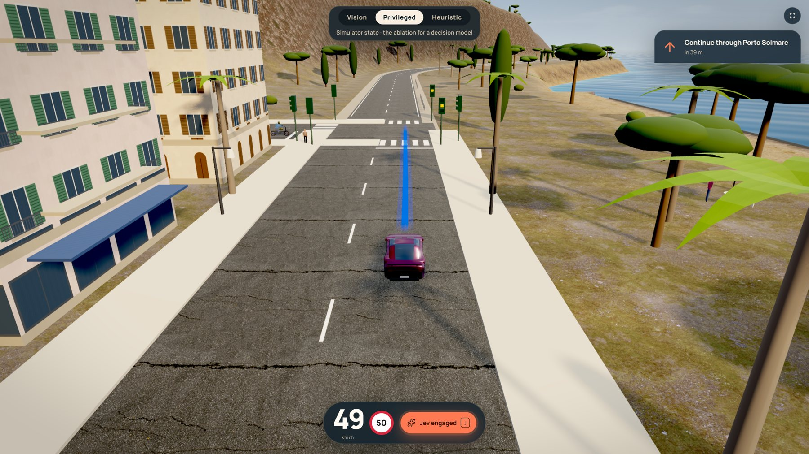
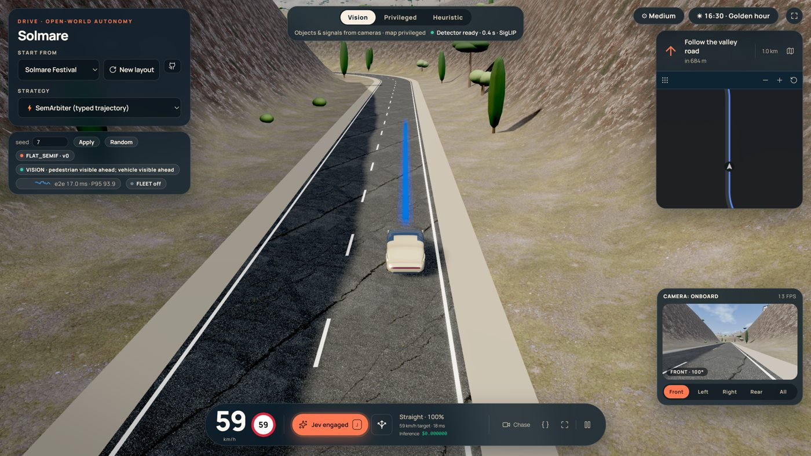
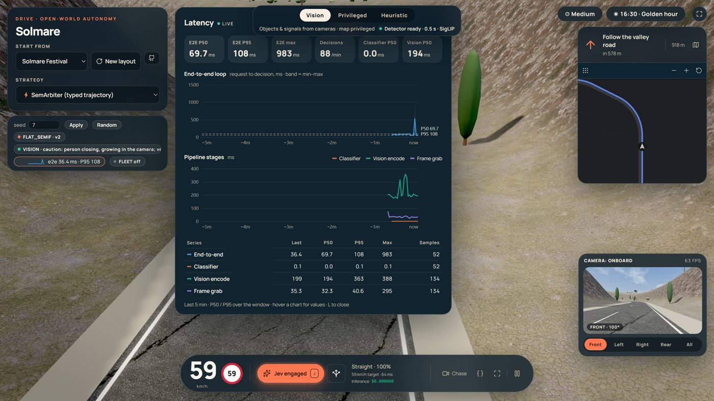
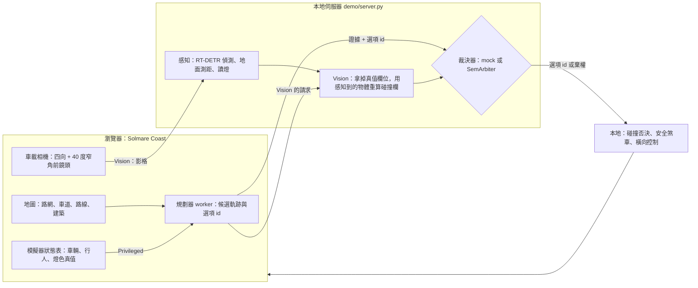

# JevPilot-Vision

**在地中海海岸的開放世界裡開自駕車，看決策模型在一個個選項之間怎麼挑。**



JevPilot-Vision 是一個在瀏覽器裡跑的 3D 駕駛應用：世界、車載相機、感知、候選軌跡、車道幾何與橫向控制都在這裡。每一步，應用把這一幀的證據和一組選項 id 交給裁決器（[SemArbiter](https://github.com/EndeavorYen/SemArbiter)，或內建的 mock），拿回其中一個選項，或者棄權。

## 亮點

- **Solmare Coast 開放世界**：約 2.4 × 1.6 km、11 km 道路。港口小鎮 Porto Solmare、海岸公路、葡萄園山谷、Passo del Falco 山口與 SS-1 快速道路；有號誌與停車再開的路口、交通車與行人。車輛與行人密度可以調（低／中／高）。
- **日照循環**：從 06:15 到 19:45，太陽、色溫、天空、霧與海面隨時間變化。
- **三種駕駛模式**，各回答一個不同的問題（見[下方](#三種模式三個問題)）：Vision、Privileged、Heuristic。
- **延遲圖表**：端到端迴圈與各階段（分類器、視覺編碼、擷取幀）的折線圖、P50／P95 與 JSON 匯出。
- **極簡介面**：一鍵（`H`）收起面板，只留轉向提示、速度與自駕開關。
- **兩檔畫質**：Medium（內顯筆電）與 High（獨顯）；車載相機看的是你選的那個世界。
- **閉環評估工具**：調參 seed 與驗收 seed 分開，以發生率與信賴區間回報闖紅燈、碰撞與停滯。

| Vision 模式：物件與號誌只來自相機，地圖仍是特權 | 延遲面板（`L`） |
| --- | --- |
|  |  |

## 快速開始

需要 Python 3.10 以上。

```bash
pip install -e .

# 用內建的 mock 裁決器啟動（不需要 GPU）
python demo/server.py --mock --port 8000

# 瀏覽器開 http://localhost:8000/jevpilot/ ，按 J 或「Jev」按鈕開自駕
```

- **Vision 模式**需要感知模型，也需要 CUDA：`pip install -e ".[neural]"`（torch、transformers；第一次執行會下載 RT-DETR 與 SigLIP 權重）。沒有安裝、或沒有 CUDA 時，偵測器不啟動，感知回報 `backend: none`，Vision 模式的車會減速停下，不會假裝看得到。要在 CPU 上跑，設 `SEMIF_PERCEPTION_DEVICE=cpu`（很慢）。
- **對接 SemArbiter**：先在另一個埠口啟動 SemArbiter，再用 `python demo/server.py --port 8000 --arbiter-url http://localhost:8001`（或設環境變數 `SEMARBITER_URL`）。
- 常用網址參數：`?mode=vision|privileged|heuristic`、`?start=festival|harbour|coast|pass|highway`、`?time=17:45`、`?gfx=medium|high`、`?traffic=low|med|high&people=low|med|high`、`?minimal=1`。

## 架構

選項與安全留在本地，模型只挑選項。這個「本地契約」**來自 upstream（SemArbiter）**，不是這一倉新發明的決策能力：幾何、候選軌跡、碰撞預測與安全煞車都在本地；模型只在這一幀的選項 id 裡挑一個，或棄權。



- **Privileged**：決策讀模擬器的狀態表（車、燈、衝突的真值）。
- **Vision**：車輛、行人與燈色只來自車載相機；連碰撞判斷都用相機看到的物體重新推演。地圖（路網、車道、路線、建築）仍來自模擬器。
- **Heuristic**：瀏覽器端、打包檔內建的幾何規則（沿道路邊界替候選打分），不呼叫裁決器。

### 怎麼打 SemArbiter

`POST /v1/classifier`（或 `/v1/systemone`）：

- `state` 是這一步的證據。駕駛的 compact 視覺證據由應用寫入，不是像素。
- `questions.*.criteria` 是這一幀的選項 id。幾何慢行與停車軌跡留在應用的候選池，不由 SemArbiter 依號誌刪掉。
- 應用不把 JPEG 送到 SemArbiter。SemArbiter 不 import 這一倉。
- 機率是讀出結果，不是另一套駕駛策略。

## 三種模式，三個問題

| 模式 | 決策讀什麼 | 它回答的問題 |
| --- | --- | --- |
| **Privileged**（預設） | 模擬器狀態表 + 地圖 | 要評**決策模型**時的消融基準：輸入是對的，選得好不好？ |
| **Vision**（`?mode=vision`） | 車載相機 + 地圖 | 沒有物件與號誌的真值，**閉環還關得起來嗎？** |
| **Heuristic** | 瀏覽器端的幾何規則（打包檔內建） | 幾何基準：不用模型能開到哪裡？ |

Vision 不是「比 upstream 更正確」的版本，它問的是另一個問題。Privileged 與 Heuristic 留著當參考，用來學習與調校 Vision。

## 限制（請先讀這段）

- **地圖仍是特權。** Vision 關掉的是動態物件與號誌的真值，不是整個世界：路網、車道幾何、路線與建築都不是相機看出來的。
- **自車定位是完美的。** 決策請求裡的車道橫向偏移（`lateral_offset_m`）、到停止線的距離、路線誤差與 `on_road`，都來自模擬器裡車子的真實位置，等於一套沒有誤差的定位。真實車輛要靠 GNSS、IMU 與地圖匹配估計這些值，誤差可達公尺級；Vision 沒有承擔這部分的難度。
- **coast 的車道比真實寬。** 一般道路一條車道 6 m，約為真實道路（3–3.75 m）的兩倍；快速道路 4 m。橫向空間大得多，閉環因此比真實容易。改成接近真實的寬度記在 [#66](https://github.com/EndeavorYen/JevPilot-Vision/issues/66)。
- **Vision 的本地否決和感知共用同一個失效來源。** Privileged 的否決用真值碰撞，和決策互相獨立；Vision 的否決用感知到的物體，偵測器漏掉一台車，否決也會一起漏掉。fail-closed 只涵蓋「知道自己看不到」（證據過期、backend 失效、沒看到燈就當紅燈），不涵蓋「看錯了」。
- **感知方法不可轉移。** RT-DETR、已知相機高度、平地針孔測距、色相讀燈，只在這個渲染器裡成立，不能當成可以搬到真實世界的證據。
- **世界曾為了感知被改過。** 為了讓相機讀得到燈，號誌燈曾改成純色自發光、平面燈片與路口對側燈頭。這是把世界擬合到感測器上；撤回的工作在 [#30](https://github.com/EndeavorYen/JevPilot-Vision/issues/30)，在它合併之前，Vision 的讀燈結果要打這個折扣。黃昏時車載相機看到的亮度也是靠調光源補償回正午水準，Vision 在暗處的表現因此沒有被測到。
- **結果是「mock 裁決器 + 這套感知」，不是任何決策模型的成績。** mock 的停車規則是手寫控制器，常數（決策間隔 1.5 s、煞車減速度 2.5 m/s² 等）量自單一機器與這張地圖。
- **發生率來自驗收 seed，不是調參 seed。** 調參用的 seed 不拿來報數字；回報一律是「k/n」加 95% 信賴區間，不用少數幾趟說「乾淨」。

### 目前的數字

驗收集（10 個 seed × 3 條路線 × 150 秒 = 30 趟，Medium 畫質），main `b9248b4`，2026-10-03，見 [#28](https://github.com/EndeavorYen/JevPilot-Vision/issues/28)：

| 模式 | 闖紅燈 | 碰撞 |
| --- | --- | --- |
| Privileged | 2/30 | 1/30 |
| Vision | 4/30 | 7/30 |
| Vision，加 400 ms 延遲 | 8/30 | 4/30（另有 8/30 趟自駕因決策過期而放棄） |

之後的修正（跟車距離 #37、舊綠燈 #38、擷取節奏 #42）都要重跑同一組驗收 seed 才算數，排程記在 [#46](https://github.com/EndeavorYen/JevPilot-Vision/issues/46)。

## 評估

```bash
# 評估工具預設連 http://localhost:8768；照上面的快速開始用 8000 時加 --base http://localhost:8000

# 閉環：Vision，驗收集，結果寫到絕對路徑
python benchmarks/closed_loop.py --set held_out --modes vision --base http://localhost:8000 --out D:/evals/<日期>/vision.jsonl

# 效能基準：主畫面與車載相機的幀時間、GPU 時間、draw call
python benchmarks/perf_baseline.py --gfx medium high --base http://localhost:8000 --out D:/evals/<日期>/perf.json
```

- 評估在共用的 debug Chrome（CDP 9222）裡開自己的分頁，跑完就關，並保留一個錨點頁。
- 評估固定使用 `traffic=low&people=low`（加入密度分級之前的世界）與只畫選中路徑，讓結果可以和舊紀錄比較。
- 官方駕駛分數仍是閉環乾淨完成。搬倉不改寫已發布數字。權重、快取與第三方原始紀錄不進這一倉。

## 細節

- **地圖：** 由 `jevpilot_vision/web/semif-worldgen.js` 生成（道路固定，seed 只改變號誌相位、建築、交通與行人），畫面由 `jevpilot_vision/web/semif-world/` 繪製。港口有粉彩鎮屋、碼頭與燈塔，山坡上有白牆別墅，路旁與山谷有絲柏、傘松、橄欖、棕櫚和葡萄園，節慶據點有拱門、舞台、帳篷與摩天輪。主角車是 Tesla：預設是程式生成的 Cybercab 風格車（兩門、淚滴形快背、沒有後窗、前後全寬燈條、香檳色），也可以換成 Model Y（打包檔原本的模型），按 `K` 或用 `?car=cybercab|model-y` 切換；車上沒有 Tesla 標誌，本專案與 Tesla 無關。交通車七款，車色避開相機遮罩。舊的 Skyline City、Small town、Interstate 08 只在 `lap=1` 或 `?world=city|town|highway` 時出現。截圖在 [`docs/visual/solmare-coast/`](docs/visual/solmare-coast/)。
- **車輛與行人密度：** ⚙ 面板的 Traffic 區塊，或 `?traffic=low|med|high&people=low|med|high`。low 是原本的數量（36 輛、28 人），預設 medium（54、42），high（72、56）；選擇會記在瀏覽器裡，`lap=1` 一律用 low。
- **日照循環：** 新地圖從 16:30 開始，15 分鐘走完 06:15 到 19:45（沒有夜晚）。時間鈕或 `T` 鍵跳到下一個時段；`?time=17:45` 固定時間，`?daycycle=0` 停住時鐘。黃昏的暗、暖與高對比只作用在主畫面的後製（`?post=0` 關閉）；車載相機經過與螢幕相同的 ACES 色調映射、曝光固定 0.95，亮度靠光源補償，維持在正午水準，由 `tests/test_daylight.py` 逐時段檢查。
- **畫質：** Medium 是加入分級之前的世界，由 `tests/fixtures/coast_medium_snapshot.json` 的結構快照鎖住；High 是之後逐步加上的優化版。⚙ 按鈕切換（會重新載入、自駕會停）；`?gfx=` 優先，其次是上次的選擇，第一次開啟時依 GPU 初選。「Show FPS」在按鈕上顯示主畫面的 fps 與 GPU 毫秒。Vision 的數字一律標明畫質。設計見 [`docs/superpowers/specs/2026-10-03-visual-quality-design.md`](docs/superpowers/specs/2026-10-03-visual-quality-design.md)。
- **Vision 模式：** RT-DETR 偵測加地面測距；另有一顆 40° 窄角前鏡頭讀遠處號誌。看不到綠燈就當紅燈。碰撞由伺服器拿感知到的物體推演每條候選軌跡；感知失效或過舊時一律減速停車。模式切換在畫面上方，選擇會記在瀏覽器裡。
- **第三方模型：** Model Y 是 [763468712](https://sketchfab.com/763468712) 的 [Tesla Model Y 2021](https://sketchfab.com/3d-models/tesla-model-y-2021-c0a86cac582d4b33aba0fb1b1912d970)，以 [CC BY 4.0](https://creativecommons.org/licenses/by/4.0/) 授權，本專案做了減面、壓縮與材質調整（[`ATTRIBUTION.md`](jevpilot_vision/web/models/model-y/ATTRIBUTION.md)）。Ferrari 458 Italia 是 vicent091036 的作品，經 three.js 範例散布（[`ATTRIBUTION.md`](jevpilot_vision/web/models/ferrari/ATTRIBUTION.md)）。
- **候選軌跡：** 預設只畫選中的那一條藍色路徑；底部的分岔箭頭按鈕顯示全部候選（含機率），選擇會記住，`?candidates=all|selected` 優先。車載相機看不到兩者。
- **延遲圖表：** 狀態列的延遲小圖點開或按 `L`：最近 1／5／15 分鐘的 end-to-end 折線圖（含 min–max 帶與 P50／P95 參考線）、三個階段的折線圖、各序列的 Last／P50／P95／Max 表，以及 JSON 匯出。
- **極簡模式：** 右上角按鈕或 `H` 鍵；選擇記在瀏覽器裡，`?minimal=1|0` 直接指定。
- **場景層：** `jevpilot_vision/web/semif-scenery.js` 負責建築立面、近處交通車、號誌燈罩、天光與小地圖輪廓；`?scenery=0` 關掉。
- **舊地圖尺寸：** 自由駕駛時，Skyline City 與 Small town 是 7×7 個路口；`lap=1`（benchmark 跑圈）維持原本 5×5，跟已發布的分數可比；`?size=3..9` 可以自訂。
- **車隊模式：** 每台交通車都可以走跟玩家同一條決策路徑，只描述它感測到的東西（車速、車道偏移、相機範圍 42 m 內的相對框、下一條停止線），任何一台車的世界座標都不會進決策。`POST /v1/fleet`（帶 `x`／`z` 的輸入回 422）；HUD 的 `FLEET` 按鈕或 `?fleet=semif` 開啟；無頭對比：`python benchmarks/benchmark_fleet.py --mock --theme town`。
- **打包檔修補：** 修改的地方與理由都列在 [`jevpilot_vision/web/BUNDLE_PATCHES.md`](jevpilot_vision/web/BUNDLE_PATCHES.md)。
- **配色限制：** 場景的配色不會落進相機的號誌、施工與警示燈色塊範圍，由 `tests/test_scenery.py` 檢查。

## 文件

- 設計：[Solmare Coast](docs/superpowers/specs/2026-10-01-solmare-coast-design.md)、[畫質分級](docs/superpowers/specs/2026-10-03-visual-quality-design.md)
- 教學：[`docs/tutorials/`](docs/tutorials/)（動態候選與裁決、Jev 與分類器的 I/O、延遲與準確度、Vision、模擬測試與控制品質）
- 給 agent 的規則：[`AGENTS.md`](AGENTS.md)
