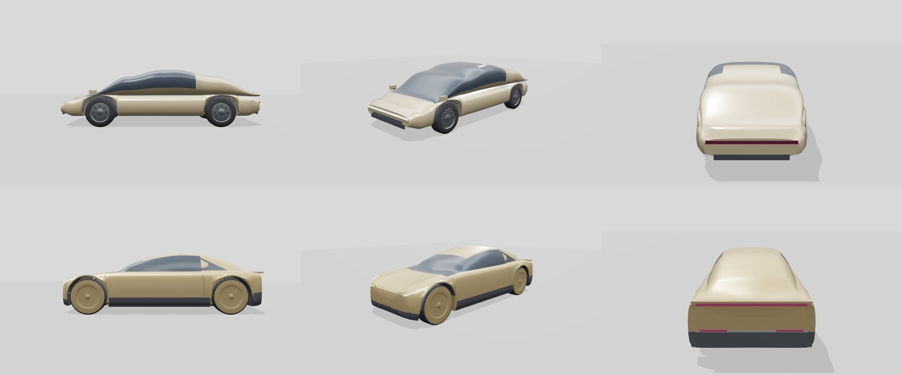
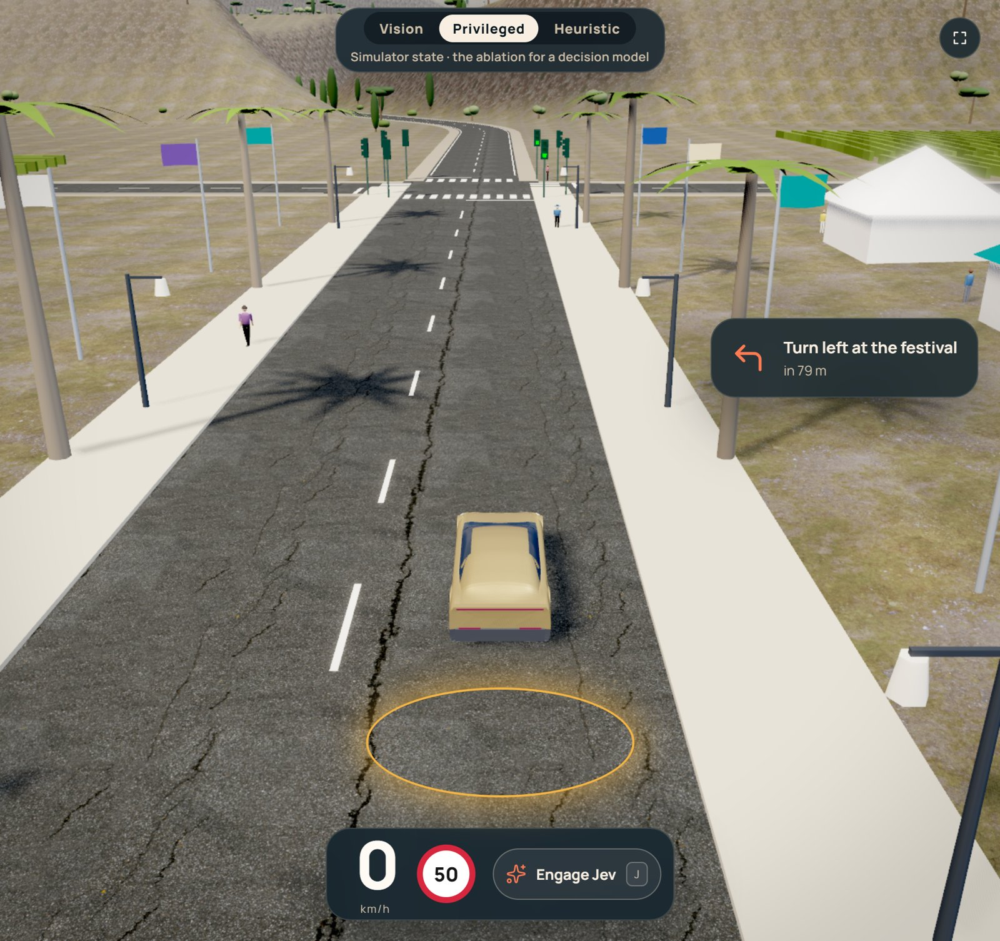
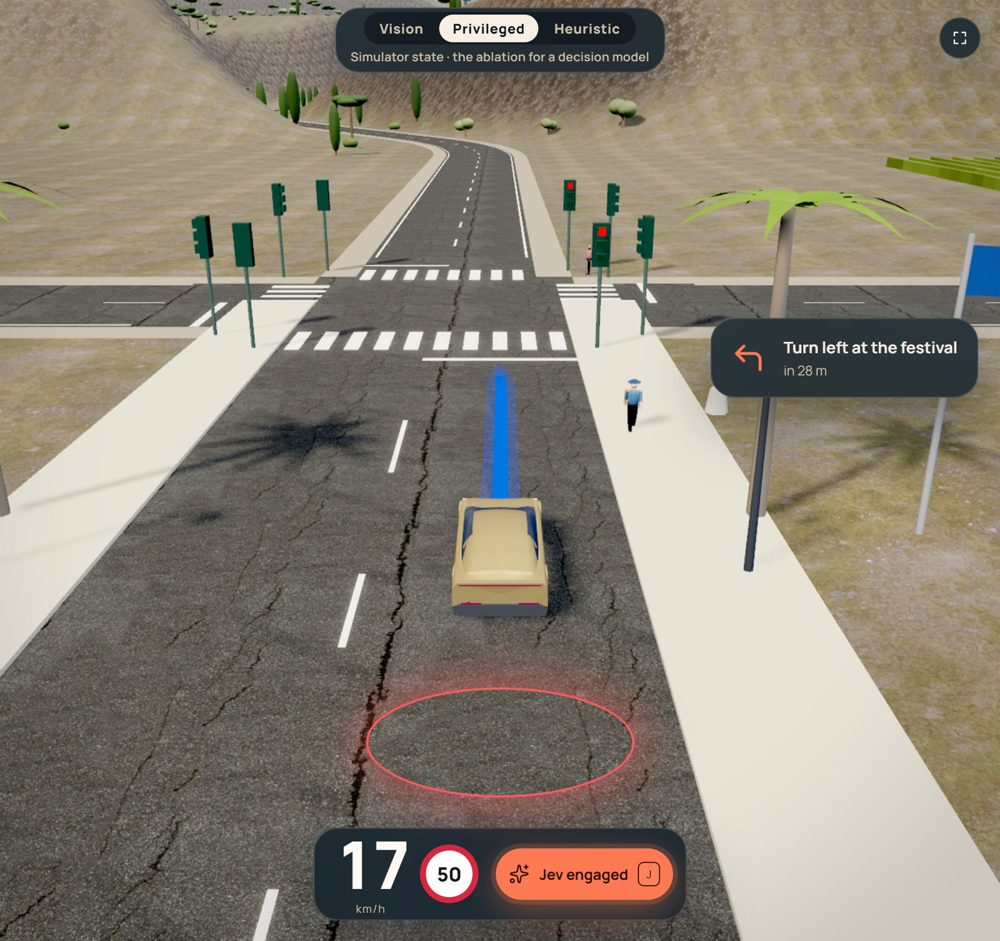

# Cybercab 風格主角車（#90）

`jevpilot_vision/web/semif-world/cybercab.js` 依 2024 年展示車的照片重建。流程照 [img2threejs](https://github.com/img2threejs/img2threejs) v2.0.0（`6e60b5e`）：影像分析 → 參考圖適用性 → 品質契約 → 規格 → 嚴格驗證 → 分輪建模，每一輪都把渲染圖和參考照片並排比對。車上沒有 Tesla 標誌或字樣，本專案與 Tesla 無關。

## 參考照片（只作參考，不放進 repo）

| 視角 | 照片 | 作者 | 授權 |
|---|---|---|---|
| 側面 | [Tesla Cybercab at Santana Row side view](https://commons.wikimedia.org/wiki/File:Tesla_Cybercab_at_Santana_Row_side_view_dllu.jpg) | Dllu | CC BY-SA 4.0 |
| 前 3/4 | [Tesla Cybercab - Berlin 2024](https://commons.wikimedia.org/wiki/File:Tesla_Cybercab_-_Berlin_2024.jpg) | Avda | CC BY-SA 4.0 |
| 正面 | [Front of the Tesla Cybercab](https://commons.wikimedia.org/wiki/File:Front_of_the_Tesla_Cybercab.jpg) | Steve Jurvetson | CC BY 2.0 |
| 背面 | [Rear of the Tesla Cybercab](https://commons.wikimedia.org/wiki/File:Rear_of_the_Tesla_Cybercab.jpg) | Steve Jurvetson | CC BY 2.0 |

照片的像素沒有進到模型裡：材質一律是單色。照片只用來量比例、判讀形體與材質，所以 repo 裡沒有任何衍生自照片的貼圖。

## 從照片量到的比例

所有尺寸都縮放進打包檔固定的 4.75 × 1.9 m 外框。

| 項目 | 值 | 怎麼來的 |
|---|---|---|
| 輪半徑 | 0.42 m | 側面照，輪徑約車長的 17%；0.42 是約定測試允許的上限 |
| 前／後懸 | 0.675／0.755 m | 側面照，約 0.74／0.85 個輪徑：輪子推到四個角落 |
| 車高 | 1.47 m | 側面照的車頂高度，經近遠平面透視修正（約 1.12 倍），屬推估 |
| 鼻尖光條 | 約 0.65 m，往兩側翼子板上揚 | 正面、前 3/4 |
| 肩線 | 約 0.99–1.0 m，水平延伸到車尾 | 側面照 |
| 黑色下側裙 | 0.18–0.38 m | 側面照 |

近側和車身中線在照片裡的比例不同，所以高度與輪徑有約 ±8% 的不確定性。

## 截圖

上排是舊版（#47），下排是新版。三個機位依序是側面、前 3/4、背面。

| 遊戲內（coast、seed 42、停車） | 遊戲內（自駕中） |
|---|---|
|  |  |

單張：[側面](side.jpg)、[前 3/4](front34.jpg)、[背面](rear.jpg) 是 #109 的外形。舊版：[側面](before-side.jpg)、[前 3/4](before-front34.jpg)、[背面](before-rear.jpg)。本機瀏覽器在傳 Three.js 時連線被重置，所以這三張是同一套網格的著色棚拍，不是頁面裡的 WebGL。

## 和照片還有差距的地方

- **顏色比照片淡**：玻璃、黑色下飾板和輪拱內襯沿用色盤的 `glass`、`trim`（深灰），尾燈沿用 `taillight`（暗紫紅），只加上同色的自發光。照片裡它們接近全黑和亮紅，但更深的黑會落進相機的行人遮罩，亮紅會落進紅燈遮罩。依 AGENTS.md，在 #30 撤回這些遮罩配色之前，不新增例外；#30 之後再調回照片的顏色。
- 玻璃是單一顏色，沒有車內的層次。
- **#107**：香檳金改成霧面（車身 roughness 0.68、輪蓋 0.70、clearcoat 0.04）。引擎蓋前緣與左右前翼子板各有一條 `trim` 分割線，落在烤漆面外約 2 mm。前燈條施工外偏 3 mm，三角面重心的中位數是 3 mm，都在殼外。色票沒有新增。
- **#109**：車身輪廓退回 #107 那一版（引擎蓋一路升上擋風玻璃，肩線約 1 m，車尾與中段同寬）。前燈條 16 mm，放在前保桿上緣，到輪拱就停。輪蓋外緣約在葉子板內 1 cm，蓋面半徑是輪徑的 0.97。尾燈主條 16 mm，自發光 0.7。沒有用 Model Y 的網格改車身。色票沒有新增。
